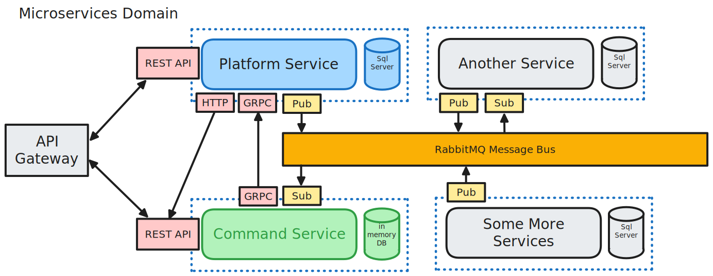
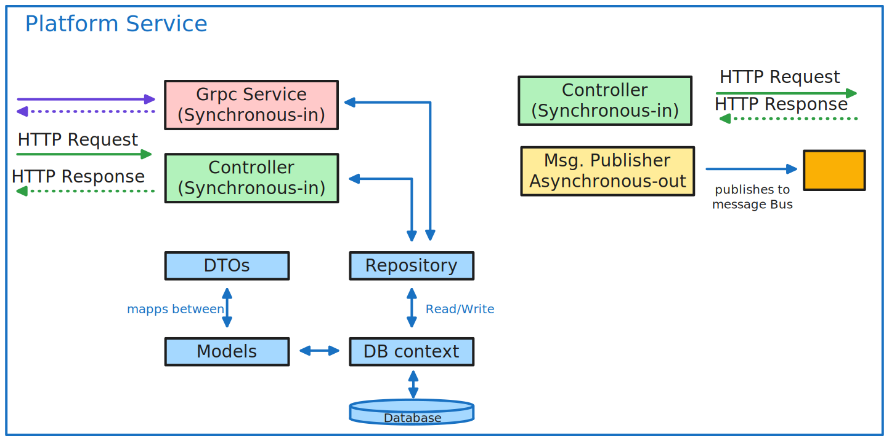
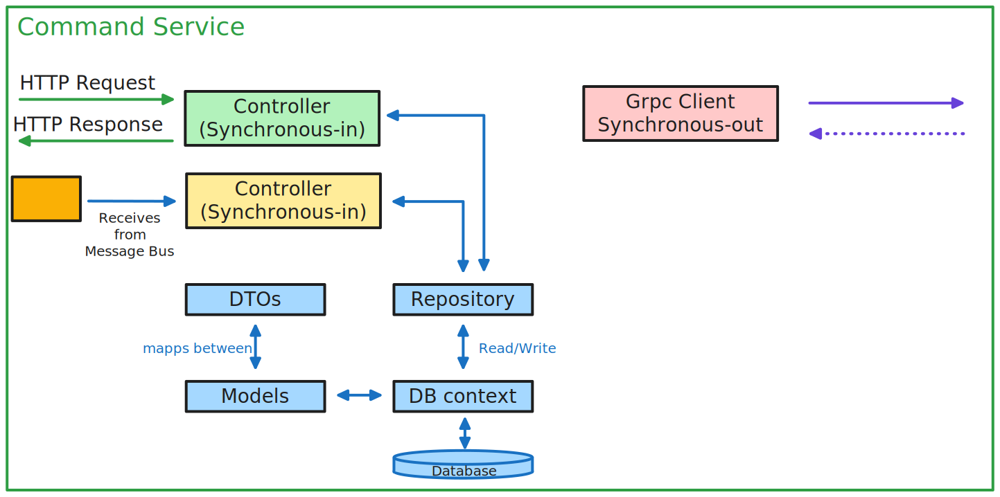

# Microservices
Going along with Les Jackson's `.Net Microsercies - Full Course` https://www.youtube.com/watch?v=DgVjEo3OGBI on Youtube
- it is using Kubernetes, RabbitMQ and GRPC. So there should be quite a few new technologies for me to learn.

Timestamps 
current: 3:25:00

INTRODUCTION & Theory
- 2:39 Course Approach
- 6:11 Course Overview
- 11:31 Ingredients & Tooling
- 16:14 What are microservices?
- 33:40 Overview of our microservices
- 37:37 Solution Architecture
- 43:54 Application Architecture 

BUILDING THE FIRST SERVICE
- 47:33 Scaffolding the service
- 52:37 Data Layer - Model
- 57:35 Data Layer - DB Context
- 1:02:38 Data Layer - Repository
- 1:16:00 Data Layer - DB Preparation
- 1:27:31 Data Layer - Data Transfer Objects
- 1:41:19 Controller and Actions

DOCKER & KUBERNETES
- 2:16:21 Review of Docker
- 2:20:55 Containerizing the Platform Service
- 2:37:29 Pushing to Docker Hub
- 2:42:43 Introduction to Kubernetes
- 2:46:54 Kubernetes Architecture Overview
- 2:58:40 Deploy the Platform service

STARTING OUR 2ND SERVICE
- 3:25:01 Scaffolding the service
- 3:30:41 Add a Controller and Action
- 3:41:50 Overview of Synchronous and Asynchronous Messaging
- 3:55:21 Adding a HTTP Client
- 4:19:34 Deploying service to Kubernetes
- 4:44:55 Adding an API Gateway

STARTING WITH SQL SERVER
- 5:07:12 Adding a Persistent Volume Claim
- 5:12:34 Adding a Kubernetes Secret
- 5:15:12 Deploying SQL Server to Kubernetes
- 5:30:31 Accessing SQL Server via Management Studio
- 5:33:06 Updating our Platform Service to use SQL Server

MULTI-RESOURCE API
- 6:06:02 End Point Review for Commands Service
- 6:09:31 Data Layer - Models
- 6:16:38 Data Layer - DB Context
- 6:21:37 Data Layer - Repository
- 6:34:53 Data Layer - Dtos
- 6:40:49 Data Layer - AutoMapper Profiles
- 6:45:26 Controller & Actions

MESSAGE BUS & RABBITMQ
- 7:20:49 Solution Architecture Overview
- 7:24:06 RabbitMQ Overview
- 7:28:55 Deploy RabbitMQ to Kubernetes

ASYNCHRONOUS MESSAGING
- 7:44:01 Add a Message Bus Publisher to Platform Service
- 8:18:07 Testing our Publisher
- 8:25:19 Command Service ground work
- 8:36:46 Event Processing
- 8:59:14 Adding an Event Listener
- 9:19:29 Testing Locally
- 9:26:28 Deploying to Kubernetes

GRPC
- 9:39:12 Overview of gRPC
- 9:44:06 Final Kubernetes networking configuration
- 9:54:32 Adding gRPC Package references
- 9:56:44 Working with Protocol Buffers
- 10:03:55 Adding a gRPC Server to Platforms Service
- 10:20:53 Adding a gRPC Client to Commands Service
- 10:39:41 Adding a Database prep class to Commands Service
- 10:48:05 Test Locally
- 10:51:01 Deploy to Kubernetes
- 10:58:43 Final thoughts & thanks
- 11:00:55 Supporter Credits

# Solution Architecture
## Microservices Architecture

**Asynchronous Messaging** (Pub-Sub) for most of our Dataflow from our Platform Service to our Comand Service.
- this allows loose coupling of those services. (the Platform Service doesn't even need to know that/if the Command Service exists)

**Grpc** is later on used to extend that model, and allow dataflow in the other direction. (Grpc is not neccessary here, but more or less used as a teaching example)

## Service Architecture
**Models** - internal data representations

**DB Context** - mediates those models down to one Database-Implementation. (ex. one for Sqlite, MongoDb, WindowsSqlServer etc...)

**DTOs** - Data-Transfer-Objects = External Representations of our Model data. (ex. only sending Data down to our Frontend the Consumer is allowed to see. Not the hashed Pw or internal Ids from our DB)

**Repository** (-Patern) - Abstracts away our DB Context implementation

**Controller(Synchronous-in)** - API Rest controller listening to external http Requests and then sending back the Response (using a Dto)

